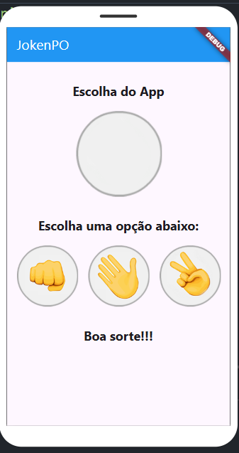

# JokenPo em Flutter

Este é um projeto simples de um jogo de JokenPo (Pedra, Papel e Tesoura) desenvolvido em Flutter. O aplicativo permite que o usuário escolha entre pedra, papel ou tesoura, e o aplicativo escolhe uma opção aleatória para competir. O resultado é exibido na tela, informando se o usuário ganhou, perdeu ou empatou.

## Funcionalidades

- **Escolha do Usuário**: O usuário pode escolher entre pedra, papel ou tesoura tocando na imagem correspondente.
- **Escolha do App**: O aplicativo escolhe aleatoriamente entre pedra, papel ou tesoura.
- **Resultado**: O aplicativo exibe o resultado da partida (vitória, derrota ou empate).

## Estrutura do Projeto

- **main.dart**: Ponto de entrada do aplicativo, onde o `MaterialApp` é configurado e o widget `Jogo` é chamado.
- **jogo.dart**: Contém a lógica principal do jogo, incluindo a escolha aleatória do aplicativo, a lógica de vitória/derrota/empate e a interface do usuário.

## Como Executar o Projeto

1. **Clone o repositório**:
   ```bash
   git clone https://github.com/seu-usuario/jokenpo-flutter.git
   cd jokenpo-flutter```
2. ** Instale as dependências:
    ```flutter pub get```
3. ** Execute o aplicativo:
   ```flutter run```
4. ** Abra o emulador ou dispositivo:
    O aplicativo será executado no emulador ou dispositivo conectado.

## Dependências
* Flutter: Framework para desenvolvimento de aplicativos móveis.
* Material Design: Biblioteca de componentes de interface do usuário fornecida pelo Flutter.

## Exemplo de Uso
* Inicie o aplicativo:

 ** O aplicativo exibirá três opções: pedra, papel e tesoura.

* Escolha uma opção:

** Toque em uma das imagens para escolher pedra, papel ou tesoura.

* Veja o resultado:

** O aplicativo escolherá uma opção aleatória e exibirá o resultado da partida.

## Capturas de Tela



## Licença
* Este projeto está licenciado sob a licença MIT. Veja o arquivo LICENSE para mais detalhes.